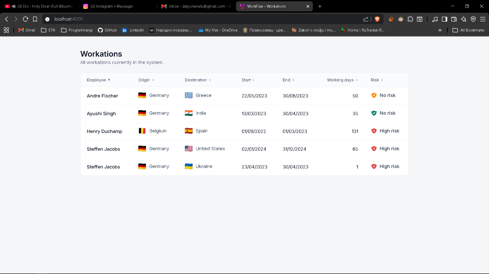

# WorkFlex – Workation Platform

Coding challenge implementation: an API that lists workations and an Angular UI that
displays them in a sortable table. Workations are imported from `workations.csv` by the
backend (never copied manually into the database).

## Tech stack

| Layer    | Technology                                            |
|----------|-------------------------------------------------------|
| Backend  | Java 21, Spring Boot 3.2, Spring Data JPA, OpenCSV    |
| Database | MySQL (H2 in-memory for tests)                        |
| Frontend | Angular 17 (standalone components), SCSS              |

## Project structure

```
.
├── backend/    # Spring Boot REST API + CSV importer
├── frontend/   # Angular table UI
└── workations.csv
```

## API

Base path: `/workflex/workation`

| Method | Path                        | Description                                         |
|--------|-----------------------------|-----------------------------------------------------|
| GET    | `/workflex/workation`       | Lists all workations currently in the system        |
| POST   | `/workflex/workation/import`| (Re)imports the bundled CSV. Idempotent by id.      |

Risk values in the CSV/API are `HIGH`, `LOW`, `NO`. In the UI both `LOW` and `NO` render
as **"No risk"** (yellow vs. green shield), while `HIGH` renders as red **"High risk"** —
as specified in the challenge.

## Running the backend

The backend connects to MySQL using these defaults (all overridable via environment
variables). `createDatabaseIfNotExist=true` is set, so the `workflex` schema is created
automatically on first run.

| Variable      | Default     |
|---------------|-------------|
| `DB_HOST`     | `localhost` |
| `DB_PORT`     | `3306`      |
| `DB_NAME`     | `workflex`  |
| `DB_USER`     | `root`      |
| `DB_PASSWORD` |  🖕         |

```bash
cd backend
mvn spring-boot:run
```

On the first startup, if the database is empty, the CSV is imported automatically
(`workflex.csv.import-on-startup=true`). The API is then available at
`http://localhost:8080/workflex/workation`.

To override credentials, e.g.:

```bash
DB_USER=myuser DB_PASSWORD=secret mvn spring-boot:run     # macOS/Linux
$env:DB_PASSWORD="secret"; mvn spring-boot:run            # Windows PowerShell
```

### Backend tests

```bash
cd backend
mvn test
```

Tests run against an in-memory H2 database, so MySQL is **not** required to run them.

## Running the frontend

```bash
cd frontend
npm install
npm start          # http://localhost:4200
```

The dev server expects the backend at `http://localhost:8080` (see
`src/environments/environment.ts`). CORS for `http://localhost:4200` is enabled on the
backend.

### Frontend tests

```bash
cd frontend
npm test
```

## Features

- **Sortable table** — every column is sortable (toggle asc/desc), handled in the frontend.
- **Dates** formatted as `dd/MM/yyyy`.
- **Flags** via [flagcdn.com](https://flagcdn.com) (country-name → ISO code mapping).
- **Risk badges** using the provided shield SVGs (red / yellow / green).
- **Row hover** highlight.

## Screenshot


